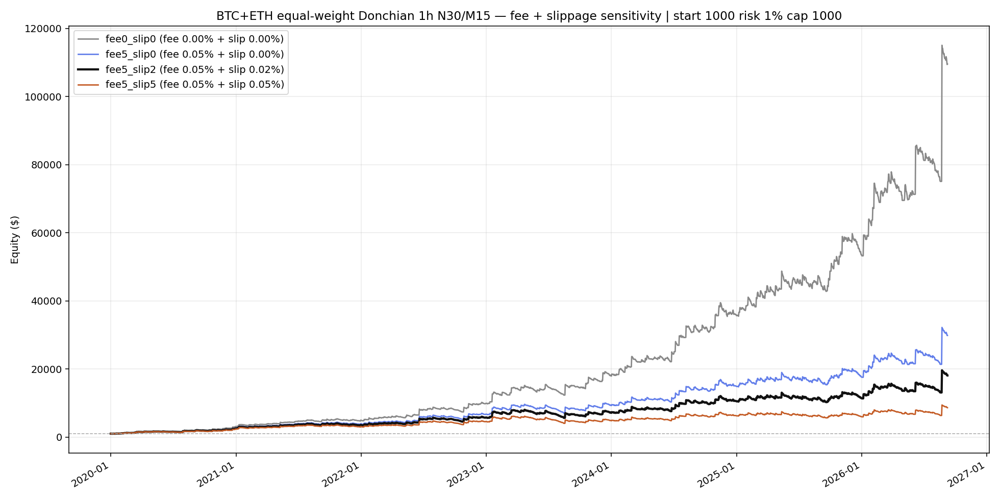

# Cost sensitivity — Binance VIP0 taker + slippage %

Venue: **Binance USD-M Futures, VIP0 taker (no BNB discount)**.
Core: **1h N=30 M=15 ATR×1.5**, BTC+ETH, risk 1% / cap $1000.

### Model
- **Fee**: % of notional per side (entry + exit).
- **Slippage**: same units — adverse fill assumption, added to fee.
- Round-trip ≈ `2 × (fee + slip) × notional`.
- **Funding ignored** (conservative gap for multi-day holds).
- Proposed calm base: **`fee5_slip2`** = taker 0.05% + slip 0.02%/side (RT ≈ 14 bps).

## Holdout 2024–2026 ($10k start)

| scenario | symbol | fee | slip | RT bps | return | maxDD | n | PF | bal |
|----------|--------|----:|-----:|-------:|-------:|------:|--:|---:|----:|
| fee0_slip0 | BTCUSDT | 0.000% | 0.000% | 0.0 | 543.6% | -23.3% | 536 | 1.52 | 64,355 |
| fee0_slip0 | ETHUSDT | 0.000% | 0.000% | 0.0 | 433.4% | -14.0% | 514 | 1.57 | 53,341 |
| fee5_slip0 | BTCUSDT | 0.050% | 0.000% | 10.0 | 210.7% | -33.6% | 536 | 1.27 | 31,066 |
| fee5_slip0 | ETHUSDT | 0.050% | 0.000% | 10.0 | 235.8% | -15.3% | 514 | 1.38 | 33,582 |
| fee5_slip1 | BTCUSDT | 0.050% | 0.010% | 12.0 | 168.5% | -35.5% | 536 | 1.23 | 26,852 |
| fee5_slip1 | ETHUSDT | 0.050% | 0.010% | 12.0 | 206.1% | -15.7% | 514 | 1.34 | 30,611 |
| fee5_slip10 | BTCUSDT | 0.050% | 0.100% | 30.0 | -27.9% | -64.1% | 536 | 0.97 | 7,214 |
| fee5_slip10 | ETHUSDT | 0.050% | 0.100% | 30.0 | 32.9% | -22.9% | 514 | 1.08 | 13,291 |
| fee5_slip2 | BTCUSDT | 0.050% | 0.020% | 14.0 | 132.1% | -37.4% | 536 | 1.20 | 23,208 |
| fee5_slip2 | ETHUSDT | 0.050% | 0.020% | 14.0 | 179.0% | -16.0% | 514 | 1.31 | 27,904 |
| fee5_slip5 | BTCUSDT | 0.050% | 0.050% | 20.0 | 49.8% | -44.1% | 536 | 1.10 | 14,979 |
| fee5_slip5 | ETHUSDT | 0.050% | 0.050% | 20.0 | 111.3% | -18.5% | 514 | 1.22 | 21,132 |

## Equal-weight BTC+ETH 2020–2026 ($1k, chart)

| scenario | fee | slip | return | maxDD | final |
|----------|----:|-----:|-------:|------:|------:|
| fee0_slip0 | 0.000% | 0.000% | **10853.2%** | **-20.1%** | **109,532** |
| fee5_slip0 | 0.050% | 0.000% | **2883.7%** | **-26.7%** | **29,837** |
| fee5_slip2 | 0.050% | 0.020% | **1707.9%** | **-29.7%** | **18,079** |
| fee5_slip5 | 0.050% | 0.050% | **762.7%** | **-34.0%** | **8,627** |

### Sleeve detail (chart scenarios)

| sleeve | fee | slip | return | maxDD | final |
|--------|----:|-----:|-------:|------:|------:|
| fee0_slip0 / BTCUSDT | 0.000% | 0.000% | 13898.5% | -23.3% | 139,985 |
| fee0_slip0 / ETHUSDT | 0.000% | 0.000% | 7808.0% | -21.5% | 79,080 |
| fee5_slip0 / BTCUSDT | 0.050% | 0.000% | 3086.6% | -33.6% | 31,866 |
| fee5_slip0 / ETHUSDT | 0.050% | 0.000% | 2680.9% | -30.2% | 27,809 |
| fee5_slip2 / BTCUSDT | 0.050% | 0.020% | 1685.6% | -37.4% | 17,856 |
| fee5_slip2 / ETHUSDT | 0.050% | 0.020% | 1730.2% | -34.0% | 18,302 |
| fee5_slip5 / BTCUSDT | 0.050% | 0.050% | 648.5% | -44.1% | 7,485 |
| fee5_slip5 / ETHUSDT | 0.050% | 0.050% | 876.8% | -40.9% | 9,768 |

CSV: `C:\All\Develop\new-algotrading-adventure\output\donchian_backtest\cost_sensitivity\summary.csv`
Chart: `C:\All\Develop\new-algotrading-adventure\output\donchian_backtest\cost_sensitivity\equity_fee_slip_sensitivity.png`
