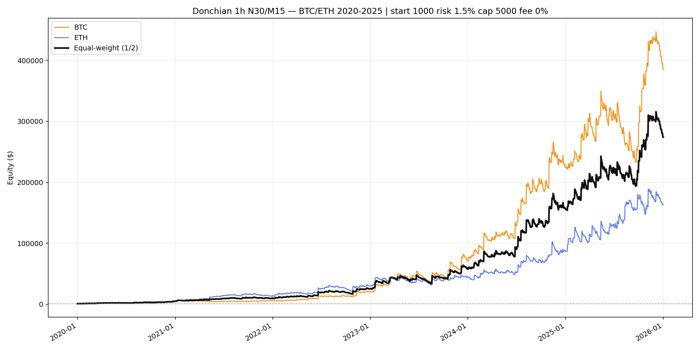

# BTC + ETH Donchian — 2020–2025

Rules: **1h N=30 M=15 ATR×1.5**, start **$1000**, risk **1.5%**, cap **$5000**, **fees 0%**.
Sleeves computed **separately**; equal-weight = mean of equity curves.

| Sleeve | Total | Max DD | Mean month | Median | Geo month | +months | Final |
|--------|------:|-------:|-----------:|-------:|----------:|--------:|------:|
| BTCUSDT | 38432.2% | -33.3% | **+9.73%** | +6.52% | +8.50% | 67% | 385,322 |
| ETHUSDT | 16203.7% | -30.6% | **+8.14%** | +4.49% | +7.33% | 72% | 163,037 |
| equal-weight | 27318.0% | -28.7% | **+8.62%** | +7.30% | +7.99% | 77% | 274,180 |

Chart: `C:\All\Develop\new-algotrading-adventure\output\donchian_backtest\multi_asset_2020_2025_r1p5_cap5k\equity_multi_equal_weight.png`
