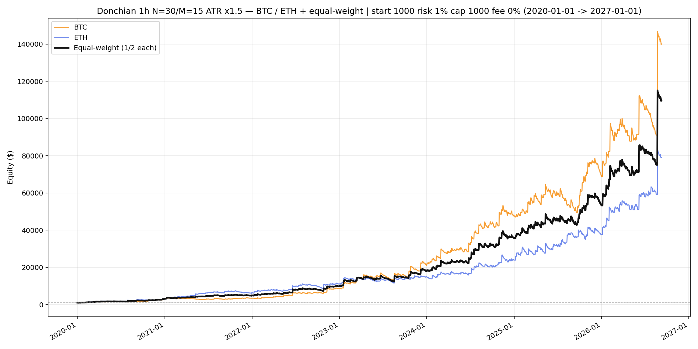

# Multi-asset Donchian equity — BTC / ETH (2020–2026)

Rules: **1h N=30 M=15 ATR×1.5**, baseline, start **$1000**, risk **1%** / cap **$1000**, **fees 0%**.
Equal-weight = mean of BTC / ETH sleeve equities (equal start, **no rebalance**).
Window: **2020-01-01 → 2027-01-01**.

| Sleeve | Return | Max DD | Trades | Final |
|--------|-------:|-------:|-------:|------:|
| BTCUSDT | 13898.5% | -23.3% | 1223 | 139,985 |
| ETHUSDT | 7808.0% | -21.5% | 1226 | 79,080 |
| **equal-weight** | **10853.2%** | **-20.1%** | — | **109,532** |

Chart: `C:\All\Develop\new-algotrading-adventure\output\donchian_backtest\multi_asset_2020_2026\equity_multi_equal_weight.png`
Daily CSV: `C:\All\Develop\new-algotrading-adventure\output\donchian_backtest\multi_asset_2020_2026\equity_daily.csv`
