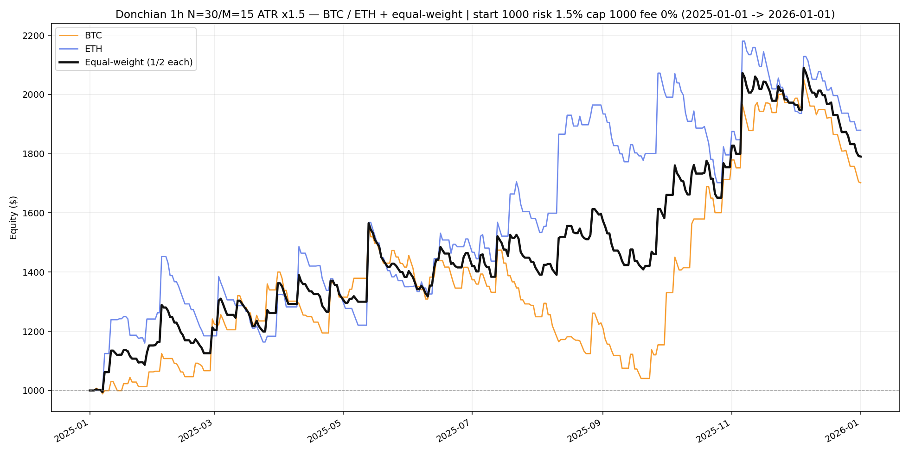

# Multi-asset Donchian equity — BTC / ETH (2025)

Rules: **1h N=30 M=15 ATR×1.5**, baseline, start **$1000**, risk **1.5%** / cap **$1000**, **fees 0%**.
Equal-weight = mean of BTC / ETH sleeve equities (equal start, **no rebalance**).
Window: **2025-01-01 → 2026-01-01**.

| Sleeve | Return | Max DD | Trades | Final |
|--------|-------:|-------:|-------:|------:|
| BTCUSDT | 70.1% | -33.4% | 203 | 1,701 |
| ETHUSDT | 87.9% | -19.9% | 197 | 1,879 |
| **equal-weight** | **79.0%** | **-15.8%** | — | **1,790** |

Chart: `C:\All\Develop\new-algotrading-adventure\output\donchian_backtest\multi_asset_2025\equity_multi_equal_weight.png`
Daily CSV: `C:\All\Develop\new-algotrading-adventure\output\donchian_backtest\multi_asset_2025\equity_daily.csv`
